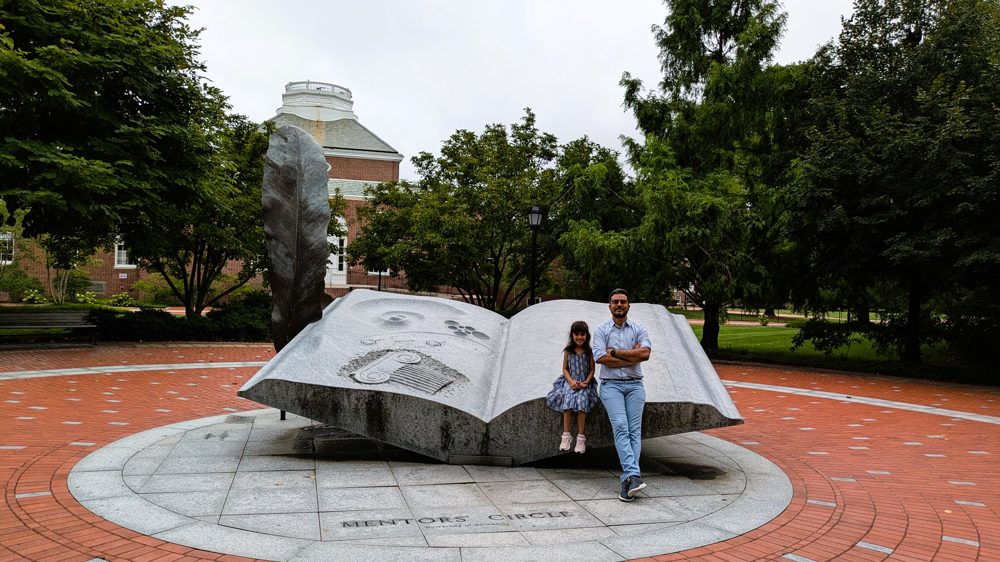
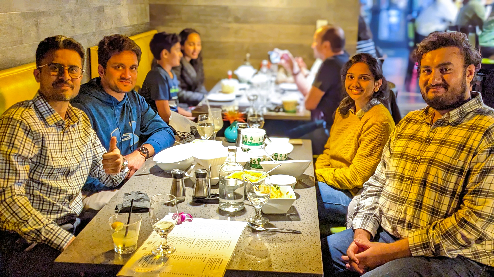
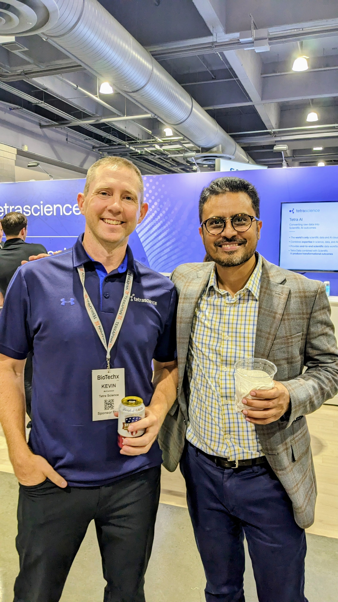

  
[Atul](https://www.linkedin.com/in/atulkakrana/) is a strategic leader & AI/ML scientist at Zifo. He leads the innovation, industry partnerships, and business strategy for the North America region. 

Atul has experience spanning 16 years in Life & Health Sciences. He worked with [Elsevier](https://www.elsevier.com/) to develop AI-based predictive solutions & NLP-based information extraction systems for [Life Science's R&D](https://www.elsevier.com/rd-solutions/pharma-and-life-sciences-solutions) and [Clinical Solutions](https://www.elsevier.com/clinical-solutions) business. 

Atul, as part of his Ph.D., developed new computational methods, solutions to (a) identify genes or biomarkers associated with human genetic diseases[4](https://academic.oup.com/nar/article/46/D1/D875/4161993) (b) discover new forms of small RNAs [1](https://academic.oup.com/nar/article/42/18/e139/2434515?login=true), [2](https://www.biorxiv.org/content/10.1101/158832v1.full) and RNA genes[3](https://genome.cshlp.org/content/early/2018/07/12/gr.228163.117) from largely unexplored regions of the genomes. To learn more about his work, see his publications on [Google Scholar](https://scholar.google.com/citations?user=virwGJEAAAAJ&hl=en)

Atul received his Ph.D. from the Department of Computer and Information Sciences at [UDel](https://www.udel.edu/) and is receipient of multiple awards & and grants for his research, including the 'Provost Distinguished Graduate Fellowship.'  

Atul has published 20+ reseach publications. His research is cited in reputed public news outlets including [NIH director's blog](https://directorsblog.nih.gov/2018/05/17/snapshots-of-life-lens-crafting/) and high impact research articles. Atul holds a Master's degree in Biochemistry and a Bachelor's degree in Biotechnology from India.

**Team Building With My Daughter, Newark, DE (2024)**

**Team building with NC Office Team Members, Cary, NC (2023)**

**Bumping Into Old Friends, BiotechX, Philadelphia, PA (2024)**
