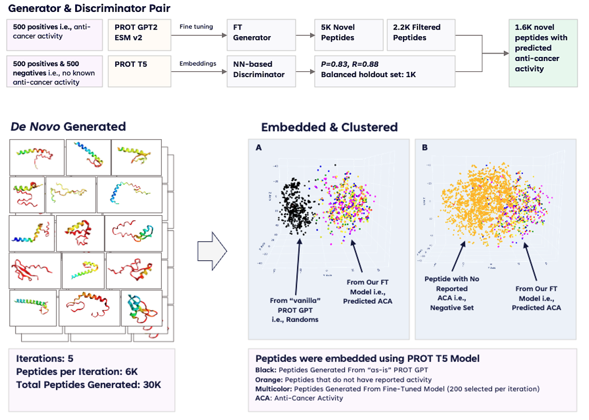



### Table Of Contents
1. [Area Of Expertise](#area-of-expertise)
2. [Digital BIology](#digital-biology)
3. [NLP & Language Modeling](#research-experience)
4. [Decision Science](#decision-science)
5. [Data & MLOPs](#data-&-mlops)
 
 

## Area Of Expertise
**ML, Deep Learning, Generative AI, & Data Science for Health, Clinical, & Life Science Research.**
* **Decision Sciences**: Predictive Modeling, Agentic-AI, Knowledge Graphs, etc.
* **Digital Biology**: Generative biology, *In Silico* Discovery, Biomolecular Modeling, etc.
* **Information Extraction**: NLP, LLMs, Explainable AI, etc.
* **Data Management Frameworks**: data products, fabric, etc.
* **Data & AIML Governance** 

The majority of my research (from 2018-2024) is done as part of innovation for Elsevier & Zifo. Before 2017, the research was done in academic and as part of non-profit research institutes and is available on my [Google Scholar](https://scholar.google.com/citations?user=virwGJEAAAAJ&hl=en&authuser=1) 
 
 

<!-- 
  
 -->

## Digital Biology 
<!-- Digital Biology combines biology, computer science, data science, and engineering. It's an emerging paradigm for analyzing, simulating, and manipulating biological data, such as using machine learning and artificial intelligence to understand biological processes, develop new drugs, and create disease models.  -->

My group focuses on the convergence of computational biology, data science, and bioengineering, particularly **applying biomolecular machine learning models to protein engineering and therapeutic design**. The objective is to investigate the underlying design principles governing protein structure and function, leveraging these insights to generate novel molecules, including peptides and antibody fragments, with optimized therapeutic properties.

The recent work from my group demonstrated the efficacy of a generative adversarial network (GAN) architecture, wherein a discriminator and generator are jointly trained to model the sequence-function landscape of anti-cancer peptides. This approach enables the *de novo* synthesis of candidate peptides exhibiting *in silico* predicted anti-cancer activity. This **research contributes to the rapidly developing field of generative biologics, which integrates foundational biomolecular modeling with high-throughput robotic synthesis and screening to accelerate the discovery of therapeutic candidates**. I presented our findings at the Pistoia Alliance (2024) meeting of biopharma executives. 

Extending on our "generative biologics" work, we are exploring methods to design new drug candidates computationally, speeding up the drug discovery process. We focus on protein and chemical structure to improve virtual screening and create entirely new molecules. 

## NLP & Language Modeling 

## Decision Science 

## Computational Biology
